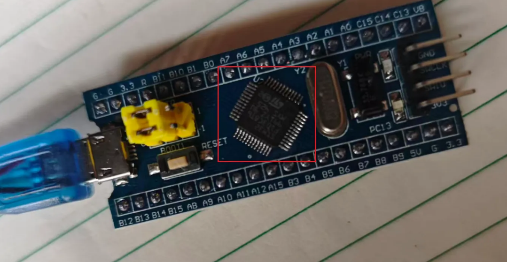
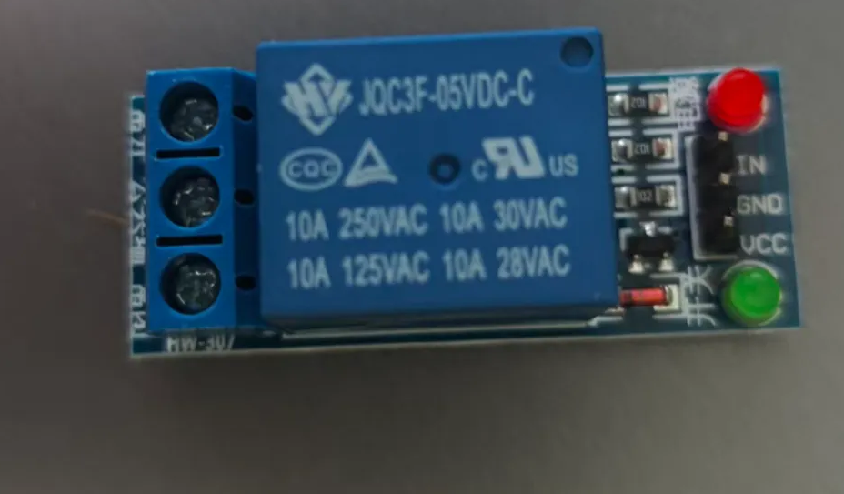
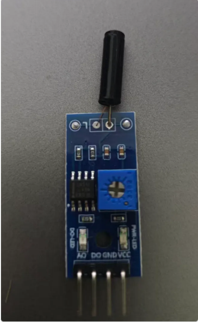
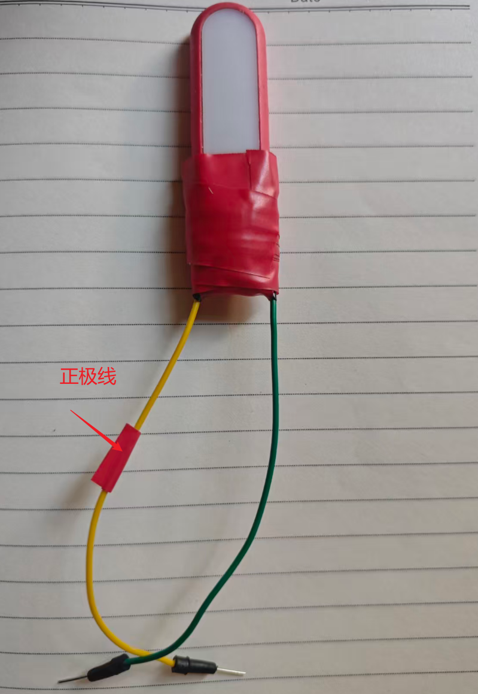
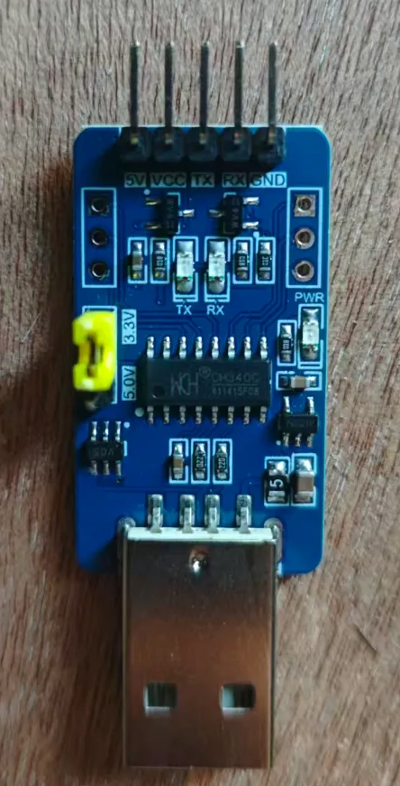
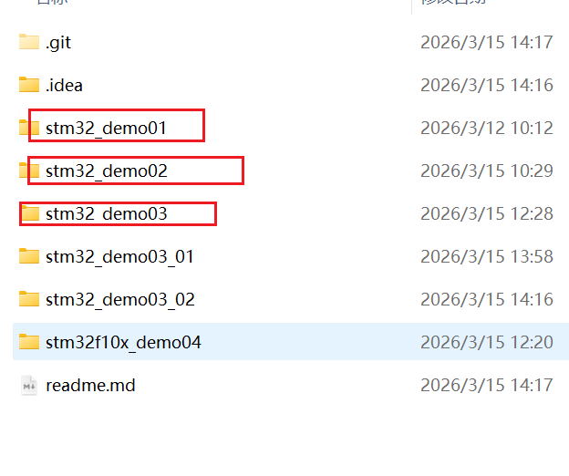

# STM32F103C8TC_code_learn

blog：www.wutunan.top

For more reference documents, please follow the blog address.

## Project material classification

- STM32F103C8T6

  It is the precise model of an ARM Cortex-M3 core microcontroller chip produced by STMicroelectronics.

  

- JQC3F-05VDC-C

  It is a small high-power electromagnetic relay

  

- SW-1801P

  

- Led  lights

  

- CH340 to TLL 

  

## Project Function Description

Trigger information through vibration sensors to light up LED lights.

## Repository structure

Each directory is a separate demo. The purpose is to enable quick review and testing.

## Project dependent custom firmware library

Customize firmware library address：[triggergun/stm32f10x_lib: Stm32f10x custom firmware library](https://github.com/triggergun/stm32f10x_lib)

## Case registration

| case         | description                    | project directory |
| ------------ | ------------------------------ | ----------------- |
| Relay Case 1 | Case study of light on and off | stm32_demo03_02   |
|              |                                |                   |
|              |                                |                   |

